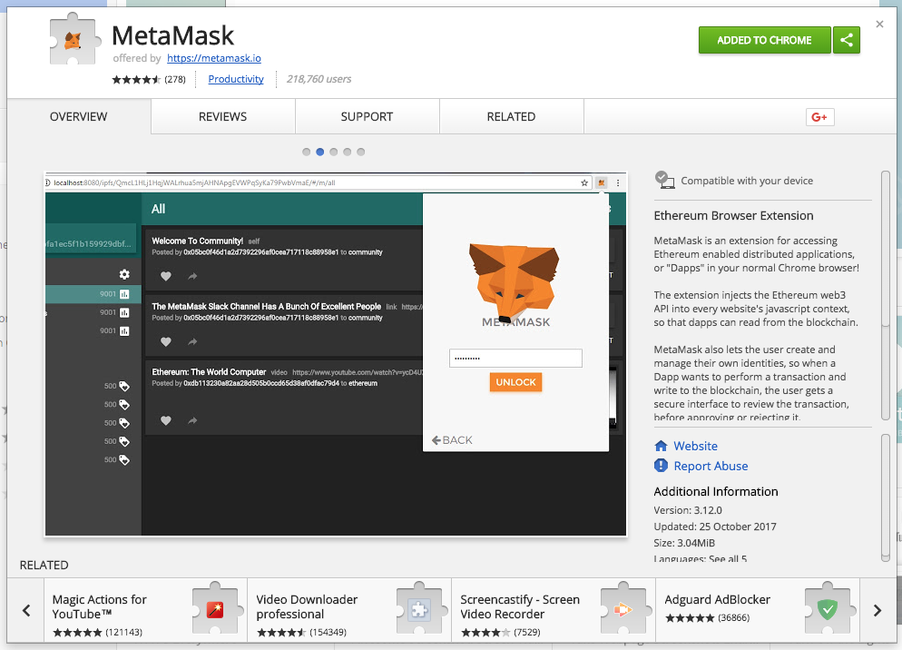
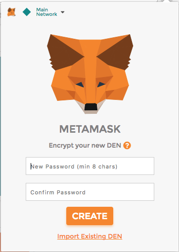
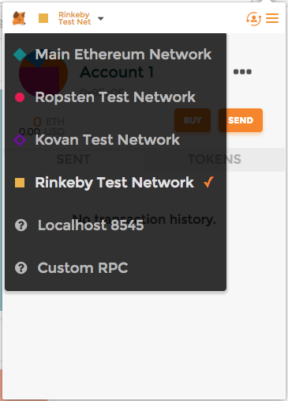
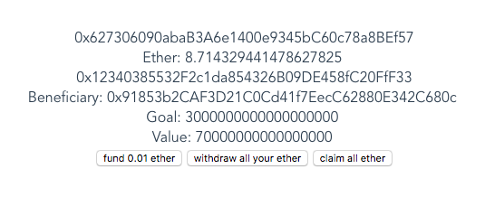

# blockchain-prototype

> A simple blockchain prototype build with Web3 and VueJS
> Testing some very basic interaction with Smart Contracts

## Demo

Install the [MetaMask Chrome extension](https://chrome.google.com/webstore/detail/metamask/nkbihfbeogaeaoehlefnkodbefgpgknn)




Open de MetaMask extension and follow the instructions to create an account or unlock an existing account




Set MetaMask to connect with the rinkeby test network




Visit the [prototype here](https://boydbueno.github.io/blockchain-prototype1/)




To interact with the application you'll need some ether on the test network. Follow the instructions on (https://faucet.rinkeby.io/) to receive some.

## Develop

### Getting the project up and running on your own machine

``` bash
# install dependencies
npm install

# serve with hot reload at localhost:8080
npm run dev
```

On Windows you'll also need to install [windows-build-tools](https://github.com/felixrieseberg/windows-build-tools)

``` bash
# Install windows-build-tools from an elevated PowerShell or CMD.exe (run as Administrator).
npm install --global --production windows-build-tools
```

Follow the above instructions for using MetaMask to access the rinkeby test network, where the contract is deployed for testing.

## Running your own node
By default the prototype uses rinkeby test network, this is where the contract is deployed. (https://rinkeby.etherscan.io/address/0x12340385532F2c1da854326B09DE458fC20FfF33)

But you can also run your own node and select it in MetaMask. Just make sure you deploy the contract `contracts/basicCrowdfunding.sol` yourself and update the address accordingly in `src/components/Home.vue:37`

The best option is probably to use [ganache](http://truffleframework.com/ganache/). But this has not been tested with this prototype. 

### Using testrpc as test node

Note: testrpc has been renamed to ganache and has undergone some changes. It's possible that the below instructions are no longer working.

```bash
# Install testrpc
npm install -g ethereumjs-testrpc

# Run testrpc
testrpc

# Run ethereum wallet on own node (https://github.com/ethereum/mist/releases)
# This allow deploying the contract through the ethereum wallet
"/Applications/Ethereum Wallet.app/Contents/MacOS/Ethereum Wallet" --rpc http://localhost:8545
```

### Running own node
This is not recommended. Syncing the rinkeby or ropsten node could take a long time

``` bash
# Starting rinkeby node from command line
geth --syncmode "fast" --rinkeby --rpc --rpccorsdomain="*" --ws --wsorigins="*" console  --rpcapi="db,eth,net,web3,personal,web3"

# Starting ropsten node from command line
geth --testnet --fast --bootnodes "enode://20c9ad97c081d63397d7b685a412227a40e23c8bdc6688c6f37e97cfbc22d2b4d1db1510d8f61e6a8866ad7f0e17c02b14182d37ea7c3c8b9c2683aeb6b733a1@52.169.14.227:30303,enode://6ce05930c72abc632c58e2e4324f7c7ea478cec0ed4fa2528982cf34483094e9cbc9216e7aa349691242576d552a2a56aaeae426c5303ded677ce455ba1acd9d@13.84.180.240:30303" --rpc --rpccorsdomain="*" --ws --wsorigins="*" --rpcapi="db,eth,net,web3,personal,web3"
```
